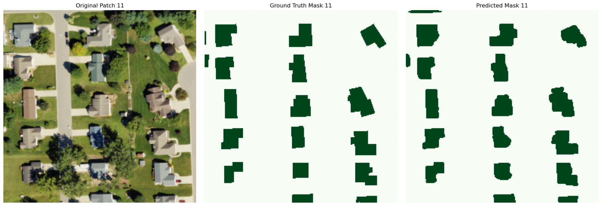
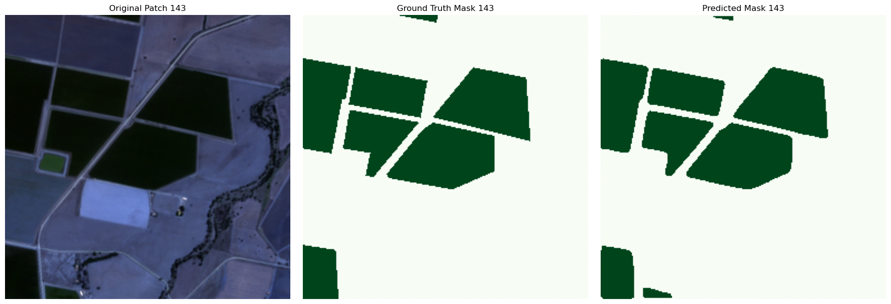

# Geo-AI Feature Extraction

This repository explores the intersection of Deep Learning and Remote Sensing. By leveraging **Semantic Segmentation**, the project automates the extraction of complex features from aerial and satellite imagery, focusing specifically on urban infrastructure and precision agriculture.

---

## Core Methodology: Semantic Segmentation
In Geospatial AI, we move beyond simple object detection (bounding boxes) to **Semantic Segmentation**. This process involves pixel-level classification, where every pixel in a satellite image is categorized. This allows for:
* **Geometric Precision:** Capturing the exact shape and area of features.
* **Boundary Integrity:** Differentiating between touching objects, such as adjacent buildings or overlapping field boundaries.


---

## 1. Building Footprint Extraction (NAIP)
**Objective:** Automated identification and mapping of residential and commercial structures using high-resolution aerial datasets.

* **Data Source:** High-resolution imagery ($256 \times 256$ patches) sourced from the **National Agriculture Imagery Program (NAIP)**. 
    * **Dataset Access:** You can browse and download this data via the [USGS Earth Explorer](https://earthexplorer.usgs.gov/).
* **Spectral Depth:** Utilized a **4-channel input configuration (RGB + Near-Infrared)**. By leveraging the NIR band, the model effectively distinguishes between non-photosynthetic roofing materials and healthy surrounding vegetation, which often share similar signatures in the visible spectrum.
* **Architecture:** Implemented a custom **U-Net** framework. The integration of **Batch Normalization** and **Dropout** layers ensures spatial robustness, allowing the model to remain accurate across varying urban shadows and diverse architectural designs.
* **Optimization:** Trained on 1,748 image-mask pairs with a 70/20/10 split. The training was guided by a **Hybrid BCE + Dice Loss** function, specifically chosen to mitigate class imbalance issues where building pixels are significantly outnumbered by the background.
* **Performance:** Reached a **Validation IoU of 0.87**, yielding highly precise geometric boundaries.
* **Visual Insight:**
    

---

## 2. Cotton Crop Identification (Sentinel-2)
**Objective:** High-precision mapping of cotton field boundaries using multi-spectral satellite constellations for agricultural monitoring.

* **Data Source:** Multi-spectral imagery ($256 \times 256$ patches) acquired from the **Sentinel-2** mission.
    * **Dataset Access:** Imagery can be accessed and downloaded via the [Copernicus Data Space Ecosystem](https://dataspace.copernicus.eu/).
* **Spectral Configuration:** Leveraged **4-channel input (RGB + Near-Infrared)**. The inclusion of the NIR band is essential for isolating the specific reflectance signatures of cotton foliage, allowing the model to distinguish healthy crops from barren soil.
* **Architecture:** A custom **U-Net** architecture specifically tuned for high-sensitivity feature extraction, ensuring the model captures the nuances of irregular field geometries.
* **Training Strategy:** Developed on a dataset of 1,597 image-mask pairs using a 70/20/10 split. The optimization process utilized `ReduceLROnPlateau` for dynamic learning rate adjustment and `EarlyStopping` to prevent overfitting.
* **Performance:** Achieved an exceptional **Validation IoU of 0.93**, demonstrating high sensitivity to narrow field boundaries and fragmented crop patches.
* **Visual Insight:**
    

---

## Tech Stack
* **Frameworks:** TensorFlow, Keras
* **Geospatial Libraries:** GDAL, OSR, Rasterio
* **Image Processing:** OpenCV, NumPy, PIL
* **Environment:** Google Colab (GPU Accelerated)

## Repository Structure
```text
Geo-AI-feature-extraction/
├── Building_Detection_final.ipynb   # End-to-end building segmentation pipeline
├── Cotton_Detection_final.ipynb     # End-to-end cotton identification pipeline
├── README.md                        # Project documentation and methodology
└── Results/                         # Comprehensive project outputs
    ├── Building-Detection/          
    │   ├── Models/                  # Final trained weights (.h5) and saved models
    │   ├── Performance Graphs/      # Loss, IoU, F1-Score, Precision/Recall, and LR plots
    │   └── Visualizations/          # Ground Truth vs. Prediction on test and new images
    └── Cotton-Detection/            
        ├── Models/                  # Final trained weights and model exports
        ├── Performance Graphs/      # Validation metrics and training history logs
        └── Visualizations/          # Ground Truth vs. Prediction on test and new images
